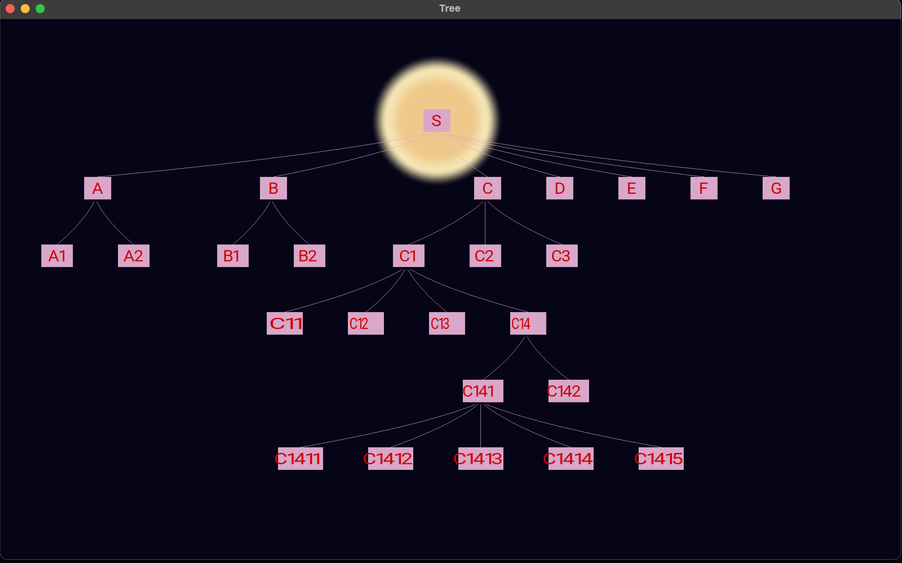

# Starting my opengl learning journey 

While I was working on a vim plugin ( still not finished :D ) , that i wanted to use
so I can finally go back to the intial project that i was working on. I came accross 
openGL video, and I was like why not start learning it and use it for my plugin. As 
I wanted to see the homemade parser that I made for the tool. I want to look at 
the parsing tree. I won't say that's usefull for this small tool, but still i want 
to do it for the fun :) 

After failing to display a tree structure on the screen. I remembered i had a 
class on algorithmes for graph visualization. But it was specific to binary trees. 
After a small search, i came a cross Walker algorithm for general tree drawing.
[Walker, J. Q. (1990). A node‐positioning algorithm for general trees. Software, Practice & Experience/Software, Practice and Experience, 20(7), 685–705. https://doi.org/10.1002/spe.4380200705](https://www.cs.unc.edu/techreports/89-034.pdf)

## Progress:

