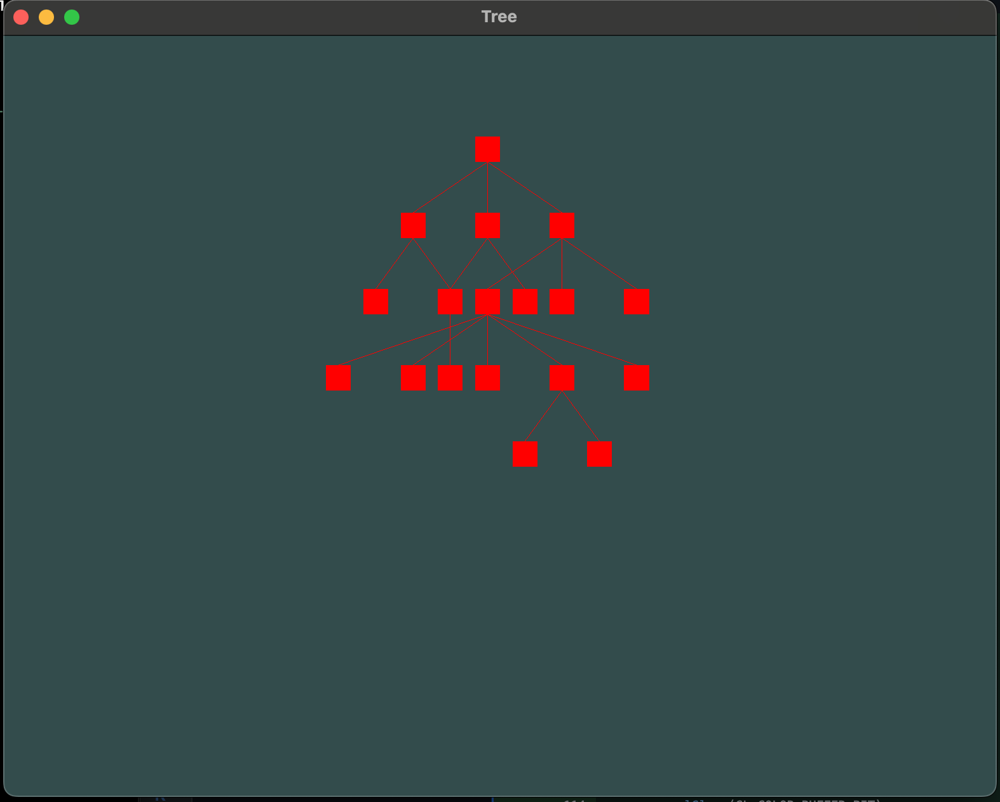

# TODOS
## Issues
### Planar drawing
the drawing isn't planar for this tree 
```cpp
Node* s = new Node(NULL, "S", 0, 200); 
Node* a = new Node(s, "A", 0, 0); 
Node* a1 = new Node(a, "A1", 0, 0); 
Node* a2 = new Node(a, "A2", 0, 0); 
Node* a21 = new Node(a2, "A21", 0, 0); 
Node* b = new Node(s, "B", 0, 0); 
Node* b1 = new Node(b, "B1", 0, 0); 
Node* b2 = new Node(b, "B2", 0, 0); 
Node* c = new Node(s, "C", 0, 0); 
Node* c1 = new Node(c, "C1", 0, 0); 
Node* c2 = new Node(c, "C2", 0, 0); 
Node* c3 = new Node(c, "C3", 0, 0); 
Node* c11 = new Node(c1, "C11", 0, 0); 
Node* c12 = new Node(c1, "C12", 0, 0); 
Node* c13 = new Node(c1, "C13", 0, 0); 
Node* c14 = new Node(c1, "C14", 0, 0); 
Node* c141 = new Node(c14, "C141", 0, 0); 
Node* c142 = new Node(c14, "C142", 0, 0); 
Node* c15 = new Node(c1, "C15", 0, 0); 
```
it results in this drawing 


### Glyph representing '1'
It looks whenever i display a char '1', it puts more space between itself and the character before. I need to play with the bearingX in case of glyph representing 1.
